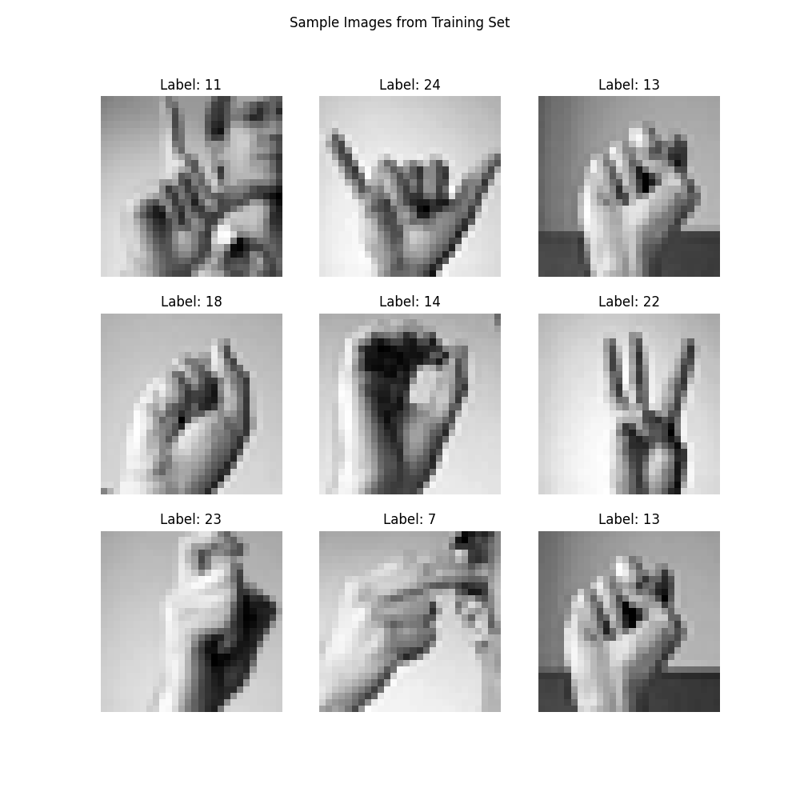
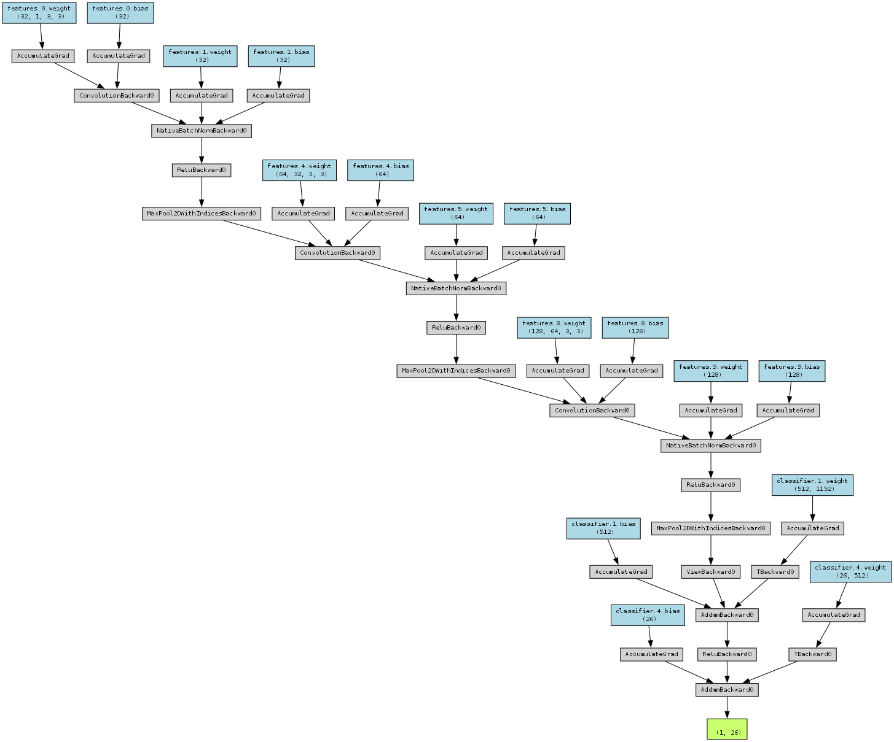
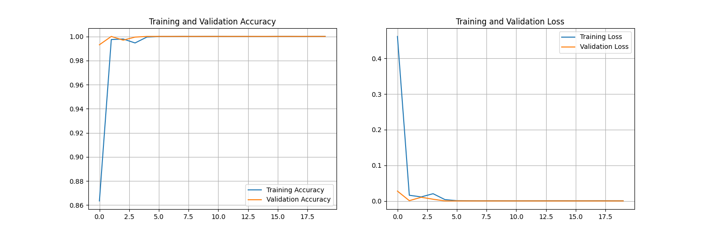
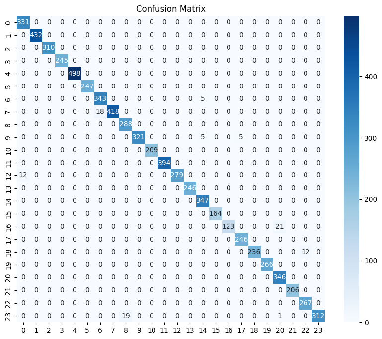
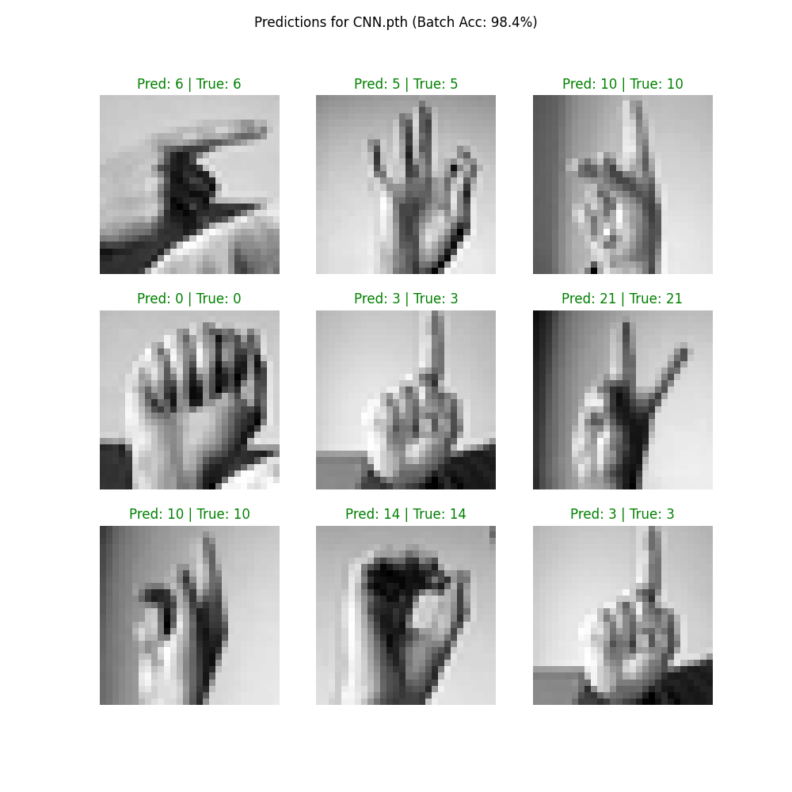

# Project Overview
This project presents a deep learning solution for the classification of American Sign Language (ASL) gestures. We have developed and trained a Convolutional Neural Network (CNN) to recognize and classify images from the Sign Language MNIST dataset, which contains a collection of grayscale hand gestures representing the alphabet (A-Z, excluding J and Z). The objective was to build an accurate and efficient model capable of identifying these characters, demonstrating a practical application of computer vision and neural networks.

## Dataset
The model was trained on the Sign Language MNIST dataset, which contains tens of thousands of grayscale images of hand signs. The dataset is structured similarly to the original MNIST dataset, making it suitable for direct use with many standard deep learning workflows.

The dataset is available on Kaggle.

### Sample Images
Below are examples of the hand gestures from the dataset that the model was trained to classify.

## Methodology and Implementation
The core of this project is a CNN built using the PyTorch framework. The implementation process involved several key stages: data preparation, model architecture design, training, and evaluation.

### 1. Data Preparation and Processing
- **Data Loading**: We utilized a custom `Dataset` class to parse CSV files containing pixel values and labels.
- **Preprocessing**: The images were reshaped from flat vectors to 28x28 grayscale images. Pixel values were normalized from [0, 255] to [0, 1] to stabilize training.
- **Augmentation**: Random splitting was used to create a validation set (20%) to monitor performance on unseen data during training.

### 2. Model Architecture
We designed a custom sequential CNN model tailored for image classification. The architecture is as follows:

- **Feature Extraction**: Three sequential convolutional blocks extract hierarchical features.
    - **Block 1**: Conv2d (32 filters) -> BatchNorm -> ReLU -> MaxPool
    - **Block 2**: Conv2d (64 filters) -> BatchNorm -> ReLU -> MaxPool
    - **Block 3**: Conv2d (128 filters) -> BatchNorm -> ReLU -> MaxPool
- **Classification Head**:
    - **Flatten**: Converts 2D feature maps to a 1D vector.
    - **Dense Layer**: 256 neurons with ReLU activation.
    - **Dropout**: Rate of 0.5 to prevent overfitting.
    - **Output Layer**: 24 neurons (one for each active class) producing class probabilities.

### 3. Model Training
- **Optimization**: The model was optimized using the `Adam` optimizer.
- **Loss Function**: `CrossEntropyLoss` was used for multi-class classification.
- **Scheduler**: A learning rate scheduler (`ReduceLROnPlateau`) was employed to adapt the learning rate during training.
- **Training Loop**: The model was trained for 20 epochs, recording accuracy and loss on both training and validation sets.

## Evaluation and Results
After training, the model's performance was thoroughly evaluated on the separate, unseen test dataset. The model achieved competitive accuracy, demonstrating its effectiveness in classifying the ASL signs.

### Confusion Matrix
A confusion matrix was generated to provide a detailed breakdown of the model's performance across all 24 classes. The matrix visualizes the relationship between the true labels and the predictions made by the model.

As seen in the matrix, the strong diagonal line indicates a high number of correct predictions.

### Sample Predictions
To provide a qualitative assessment, we visualized the model's predictions on a sample of test images. The results below show that the model correctly identifies diverse signs, highlighting its robustness.

### Conclusion
The combination of high test accuracy, a clear confusion matrix, and successful individual predictions confirms that the CNN model is highly effective for this task. The trained model weights were saved as `custom_cnn.pth` for future inference.
